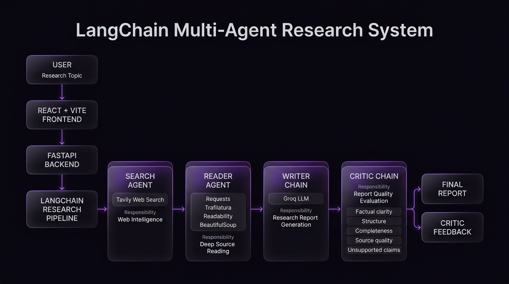

# 🤖 LangChain Multi-Agent Research System

> An autonomous AI research platform where specialized AI agents collaborate to search the web, extract information, generate structured reports, and critically evaluate the final result.

Built with **LangChain, Groq, Tavily, FastAPI, React, and Vite**.

---

## 🚀 Overview

The **LangChain Multi-Agent Research System** is a full-stack AI application that automates the research workflow from a simple topic to a structured research report.

Instead of depending on a single LLM call, the system divides the workflow into specialized stages, where each component has a clearly defined responsibility.

### Research Flow

```text
User Topic
     │
     ▼
┌─────────────────────┐
│    Search Agent     │
│   Web Intelligence  │
└──────────┬──────────┘
           │
           ▼
┌─────────────────────┐
│    Reader Agent     │
│  Deep Source Reading│
└──────────┬──────────┘
           │
           ▼
┌─────────────────────┐
│    Writer Chain     │
│   Report Generation │
└──────────┬──────────┘
           │
           ▼
┌─────────────────────┐
│    Critic Chain     │
│   Quality Evaluation│
└──────────┬──────────┘
           │
           ▼
      Final Report
```

The result is a structured and explainable research workflow rather than a simple prompt-and-response interaction.

---

## ✨ Features

* 🔎 Automated web research
* 🤖 Specialized AI research agents
* 🌐 Tavily-powered web search
* 📖 Automatic webpage content extraction
* 🧠 LLM-powered report generation
* 🧐 Automated report evaluation
* 📊 Sequential multi-stage research pipeline
* ⚡ FastAPI backend
* ⚛️ React + Vite frontend
* 🎨 Futuristic AI control-center interface
* 📝 Markdown report rendering
* 📄 Downloadable PDF reports
* 🔐 Environment-based API key management
* 🛡️ Web scraping error handling
* 🚦 Groq rate-limit retry handling
* 📱 Responsive frontend interface

---

# 🧠 Architecture

The system follows a sequential multi-agent research pipeline.



### High-Level Flow

```text
                        USER
                          │
                          ▼
                 ┌─────────────────┐
                 │  React + Vite   │
                 │    Frontend     │
                 └────────┬────────┘
                          │ HTTP
                          ▼
                 ┌─────────────────┐
                 │     FastAPI     │
                 │     Backend     │
                 └────────┬────────┘
                          │
                          ▼
              ┌────────────────────────┐
              │   LangChain Pipeline   │
              └───────────┬────────────┘
                          │
          ┌───────────────┼────────────────┐
          │               │                │
          ▼               ▼                ▼
   Search Agent     Reader Agent     Writer Chain
       │                  │                │
       ▼                  ▼                ▼
     Tavily          Web Scraping       Groq LLM
          │               │                │
          └───────────────┴────────┬───────┘
                                  │
                                  ▼
                         ┌─────────────────┐
                         │  Critic Chain   │
                         │  Quality Review │
                         └────────┬────────┘
                                  │
                                  ▼
                         ┌─────────────────┐
                         │  Final Report   │
                         │  + Feedback     │
                         └─────────────────┘
```

---

# 🤖 Multi-Agent Pipeline

## 1. 🔎 Search Agent

The Search Agent is responsible for discovering relevant information from the web.

### Responsibilities

* Understand the research topic
* Formulate search queries
* Search for recent information
* Collect titles, URLs, and snippets
* Identify potentially useful sources

### Tool

```text
web_search
     │
     ▼
Tavily Search API
```

The agent uses Tavily as its web search tool.

---

## 2. 📖 Reader Agent

The Reader Agent takes relevant URLs discovered during the search stage and extracts deeper webpage content.

The scraper uses multiple extraction strategies:

```text
URL
 │
 ├── Requests
 │
 ├── Trafilatura
 │
 ├── Readability
 │
 └── BeautifulSoup fallback
```

This layered approach improves extraction reliability across websites with different HTML structures.

### Tool

```text
scarp_url
```

> Note: `scarp_url` is the current tool name used by the backend.

---

## 3. ✍️ Writer Chain

The Writer Chain receives the collected research and generates a structured report.

The report follows this structure:

```text
Introduction
      │
      ▼
Key Findings
      │
      ▼
Conclusion
      │
      ▼
Sources
```

The Writer is instructed to prioritize:

* Factual clarity
* Structure
* Relevance
* Source usage
* Professional writing

---

## 4. 🧐 Critic Chain

Before the pipeline finishes, the Critic Chain evaluates the generated report.

It checks:

* Factual clarity
* Structure and organization
* Completeness
* Source quality
* Topic relevance
* Unsupported or questionable claims

The critic returns a score together with specific feedback.

### Example

```text
Score: 8/10

Strengths:
- Clear structure
- Relevant sources
- Strong explanation

Areas to Improve:
- Add more recent evidence
- Clarify one unsupported claim

One line verdict:
Strong report with minor improvements needed.
```

---

# 🔄 End-to-End Workflow

```text
User
 │
 │ Research Topic
 ▼
┌─────────────────────┐
│    Search Agent     │
│                     │
│     Tavily API      │
└──────────┬──────────┘
           │
           │ Search Results
           ▼
┌─────────────────────┐
│    Reader Agent     │
│                     │
│ Requests            │
│ Trafilatura         │
│ Readability         │
│ BeautifulSoup       │
└──────────┬──────────┘
           │
           │ Extracted Content
           ▼
┌─────────────────────┐
│    Writer Chain     │
│                     │
│ Research → Groq LLM │
└──────────┬──────────┘
           │
           │ Generated Report
           ▼
┌─────────────────────┐
│    Critic Chain     │
│                     │
│ Report Evaluation   │
└──────────┬──────────┘
           │
           ▼
      Final Report
      + Feedback
```

---

# 🛠️ Tech Stack

## Backend

| Technology     | Purpose                       |
| -------------- | ----------------------------- |
| Python         | Core backend language         |
| FastAPI        | REST API                      |
| LangChain      | Agent orchestration           |
| LangChain Groq | Groq LLM integration          |
| Groq           | LLM inference                 |
| Tavily         | Web search                    |
| Requests       | HTTP requests                 |
| Trafilatura    | Web content extraction        |
| Readability    | Article extraction            |
| BeautifulSoup  | HTML parsing                  |
| Pydantic       | Request validation            |
| python-dotenv  | Environment variables         |
| Rich           | Terminal output and debugging |

## Frontend

| Technology     | Purpose                          |
| -------------- | -------------------------------- |
| React          | User interface                   |
| Vite           | Frontend tooling                 |
| JavaScript     | Application logic                |
| React Markdown | Markdown report rendering        |
| Remark GFM     | GitHub-Flavored Markdown support |
| jsPDF          | PDF generation                   |
| html2canvas    | Report rendering for PDF export  |

---

# 📂 Project Structure

```text
LangChain-Multi-Agent-Research-System/
│
├── backend/
│   ├── main.py
│   ├── requirements.txt
│   │
│   └── src/
│       ├── Agents/
│       │   ├── __init__.py
│       │   └── agents.py
│       │
│       ├── Tools/
│       │   ├── __init__.py
│       │   └── tools.py
│       │
│       └── Pipelines/
│           ├── __init__.py
│           └── pipeline.py
│
├── frontend/
│   ├── src/
│   │   ├── components/
│   │   │   ├── PipelinePanel.jsx
│   │   │   ├── ResultsSection.jsx
│   │   │   └── StepCard.jsx
│   │   │
│   │   ├── api.js
│   │   ├── App.jsx
│   │   ├── index.css
│   │   └── main.jsx
│   │
│   ├── package.json
│   ├── vite.config.js
│   └── index.html
│
├── docs/
│   └── architecture.png
│
├── .env.example
├── .gitignore
├── LICENSE
└── README.md
```

---

# ⚙️ Installation

## 1. Clone the Repository

```powershell
git clone https://github.com/MohamedAymanDev/LangChain-Multi-Agent-Research-System.git

cd LangChain-Multi-Agent-Research-System
```

---

# 🐍 Backend Setup

Navigate to the backend:

```powershell
cd backend
```

Create a virtual environment:

```powershell
python -m venv .venv
```

Activate it on Windows PowerShell:

```powershell
.\.venv\Scripts\Activate.ps1
```

Install the backend dependencies:

```powershell
pip install -r requirements.txt
```

---

# 🔐 Environment Variables

Create a `.env` file according to your local configuration.

Required API keys:

```env
GROQ_API_KEY=your_groq_api_key_here
TAVILY_API_KEY=your_tavily_api_key_here
```

Never commit your real `.env` file to GitHub.

A template is provided in:

```text
.env.example
```

---

# ▶️ Run the Backend

From the `backend` directory:

```powershell
python -m uvicorn main:app --reload
```

The FastAPI server will be available at:

```text
http://127.0.0.1:8000
```

### Health Check

```text
GET /health
```

Expected response:

```json
{
  "status": "ok"
}
```

FastAPI also provides interactive API documentation at:

```text
http://127.0.0.1:8000/docs
```

---

# ⚛️ Frontend Setup

Open a second terminal.

Navigate to the frontend:

```powershell
cd frontend
```

Install dependencies:

```powershell
npm install
```

Start the development server:

```powershell
npm run dev
```

The frontend will normally be available at:

```text
http://localhost:5173
```

---

# 🔌 API

## Health Check

### Request

```http
GET /health
```

### Response

```json
{
  "status": "ok"
}
```

---

## Run Research

### Request

```http
POST /research
```

### Example Request

```json
{
  "topic": "Future of AI Agents in 2026"
}
```

### Example Response

```json
{
  "topic": "Future of AI Agents in 2026",
  "search_results": "...",
  "scraped_content": "...",
  "report": "...",
  "feedback": "..."
}
```

The research endpoint executes the complete pipeline:

```text
Search
  ↓
Read
  ↓
Write
  ↓
Critic
  ↓
Final Result
```

---

# 🛡️ Error Handling & Reliability

The backend includes handling for several failure scenarios:

* Empty research topics
* Invalid API requests
* Failed webpage requests
* Connection errors
* Scraping failures
* LLM failures
* Groq rate limits
* Pipeline exceptions

The Critic stage also includes retry logic for temporary Groq rate-limit errors.

The scraping layer uses multiple extraction strategies so that failure in one extraction method does not immediately terminate the entire scraping process.

---

# 🎨 Frontend Experience

The frontend is designed as an **AI Research Control Center** rather than a traditional form-based application.

### Interface Highlights

* Live system status
* Research command interface
* Agent pipeline visualization
* Animated agent transitions
* Research progress feedback
* Structured Markdown reports
* Critic feedback display
* Downloadable PDF reports
* Responsive interface

The visual design focuses on a futuristic AI environment with a dark interface, glassmorphism elements, and purple/violet accents.

---

# 📊 Example Use Cases

The system can be used to research topics such as:

```text
Future of Large Language Models

AI Agents in 2026

Generative AI in Healthcare

Autonomous AI Systems

LLM Applications in Software Engineering

AI Industry Trends
```

The architecture can also be extended to support more specialized research workflows.

---

# 🧪 Engineering Concepts

This project was built to explore practical implementation of:

* Multi-Agent Systems
* LLM orchestration
* Tool calling
* Web research automation
* Prompt engineering
* Web scraping
* REST API development
* Full-stack AI applications
* AI system reliability
* Automated report evaluation
* Rate-limit handling

The goal is not simply to call an LLM.

The goal is to design a structured system where specialized AI components collaborate toward a common objective.

---

# 🚀 Future Improvements

The architecture can be extended with:

* Streaming agent execution
* Real-time backend agent status
* Parallel research agents
* Source credibility scoring
* Citation verification
* Persistent research history
* Vector database integration
* RAG-based research memory
* Multi-document research
* Human-in-the-loop review
* Authentication and user accounts
* Cloud deployment
* Background task processing
* Agent execution tracing

---

# 📌 Project Status

**Active Development**

The current version implements a sequential multi-agent research workflow consisting of:

```text
Search Agent
     ↓
Reader Agent
     ↓
Writer Chain
     ↓
Critic Chain
```

The application currently provides a React/Vite frontend connected to a FastAPI backend.

---

# 👨‍💻 Author

## Mohamed Ayman Yahya

**Aspiring Machine Learning Engineer | AI Student**

Interested in:

* Machine Learning
* Deep Learning
* Natural Language Processing
* Generative AI
* Retrieval-Augmented Generation
* AI Agents
* LLM Applications

---

# ⭐ Support

If you find this project useful, consider giving the repository a ⭐ and exploring the code.

Feel free to experiment with different research topics and extend the architecture with your own agents, tools, and workflows.

---

## 📄 License

This project is licensed under the **MIT License**.

See the [LICENSE](LICENSE) file for details.
